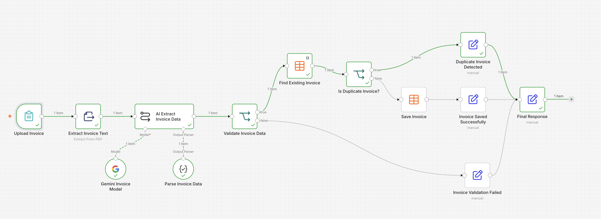
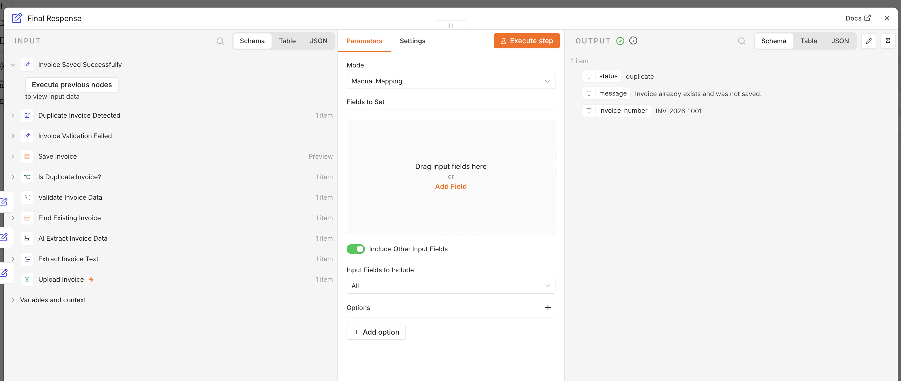
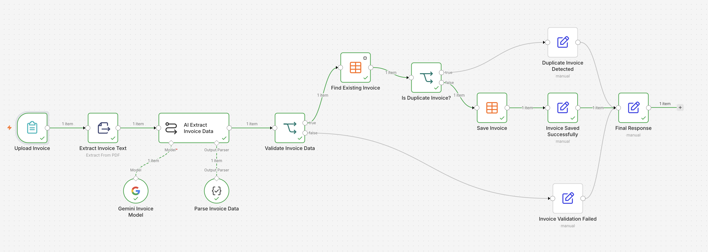
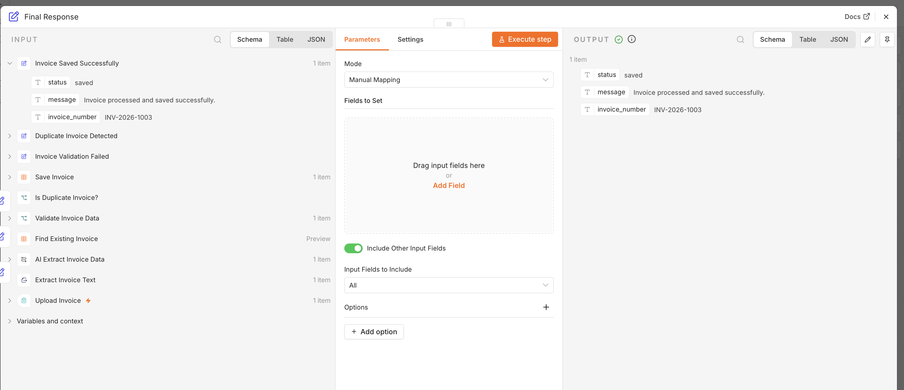
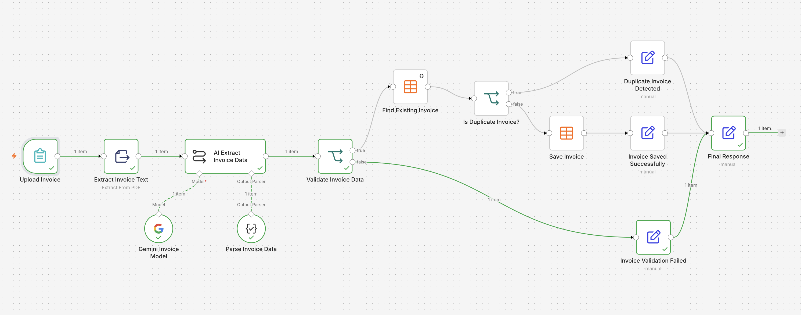
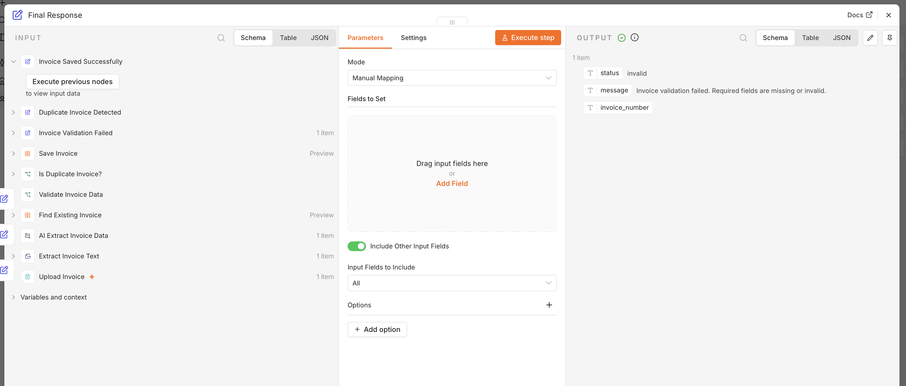
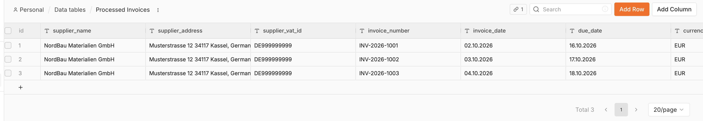

# AI Document & Invoice Processing Automation

An AI-powered invoice processing workflow built with **n8n** and **Google Gemini**.

The workflow processes PDF invoices, extracts structured data using AI, validates required fields, detects duplicate invoices, and stores valid records automatically.

## Workflow

**PDF Upload → Text Extraction → AI Data Extraction → Validation → Duplicate Detection → Data Storage → Final Response**

The workflow extracts structured invoice information including supplier details, invoice number, dates, currency, project, VAT, payment reference, and financial amounts.

### Key Features

- PDF invoice processing
- AI-powered structured data extraction with Google Gemini
- Structured Output Parser
- Required-field and amount validation
- Duplicate detection by invoice number
- Automated storage in n8n Data Tables
- Separate responses for saved, duplicate, and invalid invoices

## Workflow Tests

### Duplicate Invoice

The workflow detects an existing invoice and prevents it from being stored again.

### New Invoice

A valid new invoice passes validation, is checked for duplicates, and is automatically stored.

### Invalid Invoice

Invoices with missing or invalid required data are rejected before storage.

## Processed Invoice Data

Validated invoices are stored as structured records in an n8n Data Table.

## Workflow File

The public n8n workflow is available here:

[`ai-invoice-processing-workflow.json`](ai-invoice-processing-workflow.json)

After importing, configure your own **Google Gemini credentials** and **n8n Data Table**.

## Tech Stack

`n8n` · `Google Gemini` · `AI Document Processing` · `PDF Extraction` · `Structured Output` · `Data Validation` · `Duplicate Detection`

> **Note:** All invoices and company information shown in this repository are fictional test data created for workflow demonstration.

## Author

**Inna Siliaieva**  
Automation & Data Specialist
